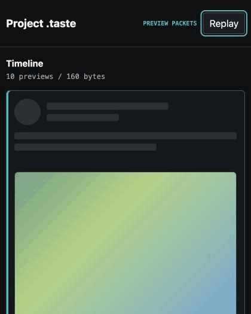

# Project .taste

[](https://github.com/Akari-H-111/taste-packet/actions/workflows/ci.yml)
[](https://www.npmjs.com/package/xtaste-client-sdk)
[](https://github.com/Akari-H-111/taste-packet/releases)
[](LICENSE)

> *"The shape arrives first. The story follows."*

Project .taste is a zero-runtime-dependency TypeScript SDK that sends a fixed
16-byte semantic preview before the full content of a social post arrives. A
client can reserve layout, paint a visual palette, and show interaction state
while text and media continue loading through the application's existing API.

<p align="center">
  <a href="https://akari-h-111.github.io/taste-packet/tests/demo.html">
    
  </a>
</p>

**[Open the live demo](https://akari-h-111.github.io/taste-packet/tests/demo.html)**

[Install from npm](https://www.npmjs.com/package/xtaste-client-sdk) ·
[Read protocol v1](PROTOCOL.md) ·
[View the Devpost submission](https://devpost.com/software/project-taste)

- Exactly 16 bytes per preview packet.
- Zero runtime dependencies and no framework requirement.
- Deterministic 100-post fixture: 47.40 KB JSON -> 1.56 KB preview packets
  (96.70% fewer bytes before full content arrives).

## Install

```bash
npm install xtaste-client-sdk
```

## Use

```typescript
import { TasteDecoder, TasteEncoder } from 'xtaste-client-sdk';

const packet = TasteEncoder.encode({
  postId: 'post-42',
  text: 'The full story can arrive later.',
  mediaCount: 1,
  mediaType: 1,
  engagement: 12000,
  emotionScore: 0.9,
  socialState: {
    liked: true,
    reposted: false,
    commented: false,
    bookmarked: false,
    closeFriend: false,
    following: true,
    muted: false,
    blocked: false,
  },
  layout: 1,
});

const preview = TasteDecoder.decode(packet.buf);

console.log(packet.buf.byteLength); // 16
console.log(preview.layout.mediaType); // 1
```

`TasteEncoder` is the server or edge projection step. `TasteDecoder` is the
client hydration step. Project .taste does not replace the full-content API or
define transport, delivery, ordering, or retransmission.

## Packet

Every packet is one 4x4 semantic matrix:

```text
               Byte 0          Byte 1          Byte 2          Byte 3
           +---------------+---------------+---------------+---------------+
  Row 0    |  VertexColorA |  VertexColorB |  VertexColorC |  VertexColorD |
           +---------------+---------------+---------------+---------------+
  Row 1    |  EmotionBase  |  AnimVelocity |  GrainTexture |  LightField   |
           +---------------+---------------+---------------+---------------+
  Row 2    |  UILayoutSpec |  ElemDensity  |  MediaType     |  TextLength   |
           +---------------+---------------+---------------+---------------+
  Row 3    |  HotBucket    |  Interaction  |  Reserved14    |  ProtocolVer. |
           +---------------+---------------+---------------+---------------+
```

The packet is a preview contract, not compressed content. See
[`PROTOCOL.md`](PROTOCOL.md) for byte ranges, derivations, version behavior,
and the canonical v1 test vector.

## Verification

Requirements: Node.js 20 or newer.

```bash
git clone https://github.com/Akari-H-111/taste-packet.git
cd taste-packet
npm run setup
npm test
npm run benchmark
```

`npm test` builds the published SDK surface and checks runtime exports, the
canonical and cross-language vectors, all interaction masks, engagement
boundaries, input validation, and malformed or unsupported packets.

The deterministic benchmark compares a representative social timeline fixture containing
100 posts with 100 encoded packets:

```text
[Baseline] 100 JSON posts: 47.40 KB (48542 bytes)
[Project .taste] 100 packets: 1.56 KB (1600 bytes)
[Result] 96.70% fewer bytes (0 runtime dependencies)
```

This fixture is reproducible evidence for one defined input, not a claim about
every production timeline or network.

## Browser demo

The hosted demo decodes ten checked-in packets, renders their previews, and
fetches full content from a separate local JSON resource. It needs no
credentials or bundler. To run the same files locally:

```bash
npm run build
python3 -m http.server 4173
```

Open <http://localhost:4173/tests/demo.html>.

## Supported platforms

- Node.js 20+ for SDK development, tests, and benchmarks.
- Modern browsers with ES modules for client-side decoding.
- macOS, Linux, and Windows environments with Node.js installed.

## OpenAI Build Week

Project .taste was submitted to the Developer Tools track of OpenAI Build
Week. [View the Devpost submission](https://devpost.com/software/project-taste)
or [watch the 2:56 demo](https://www.youtube.com/watch?v=vQBAJQhKELE).

### How Codex and GPT-5.6 were used

Codex with GPT-5.6 helped inspect the original prototype, remove speculative
runtime layers, implement the TypeScript SDK, verify the exported package,
build the deterministic benchmark and browser demo, and prepare CI and release
documentation. Product and protocol decisions remained human-reviewed; the
working implementation, tests, package, demo, and claims all point to the same
behavior.

The `/feedback` Codex Session ID is recorded in the private Devpost judging
fields rather than committed to this public repository.

## FAQ

**Does 16 bytes contain the real text and images?**

No. It contains enough information to render a stable preview. Full content
loads independently through the host application's existing API.

**Does this require a database migration?**

No. The encoder can run beside an API gateway, server, or edge function and
emit the packet without changing storage.

**How does versioning work?**

Byte 14 is reserved and byte 15 stores the protocol version. The v1 decoder
rejects unknown versions so the application can fall back to its full-content
path instead of interpreting incompatible bytes.

## Feedback and contributions

Have a timeline shape that the v1 packet cannot express?
[Open an issue](https://github.com/Akari-H-111/taste-packet/issues/new).
For code changes, see [`CONTRIBUTING.md`](CONTRIBUTING.md). If the protocol is
useful, a star helps other performance-minded developers find it.

## License

MIT. See [`LICENSE`](LICENSE).
